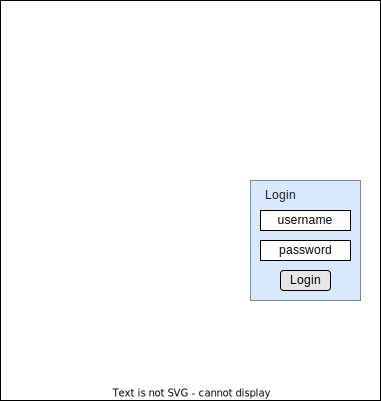

# [cookie][3pca] 5 日目: 認証の連携

## Intro

このエントリは、 3rd Party Cookie Advent Calendar の 5 日目である。

- 3rd Party Cookie のカレンダー | Advent Calendar 2023 - Qiita
  - https://qiita.com/advent-calendar/2023/3rd-party-cookie

前回は、 3rd Party Cookie を使った広告のリターゲティングの仕組みを解説した。

「あの気持ち悪い広告の正体は 3rd Party Cookie だったのか」と思った人もいるかもしれない。

そんな諸悪の根源である 3rd Party Cookie など「さっさと無効にしてしまえばいいのでは?」と思うかもしれないが、それは簡単なことではない。なぜなら、3rd Party Cookie のユースケースは、ネガティブなものだけではないからだ。

その一例として、今回は認証連携のユースケースを解説する。


## 認証の連携

認証は自前で実装する負荷が高いため、 3rd Party の認証サービスを導入することがある。ここでは "Auth1" という架空の認証プロバイダーを考えてみよう。

Auth1 は、以下のような UI を提供し、ログイン画面をサイトに埋め込むことができるとする。



このログイン画面は、実際は Auth1 の提供する `<iframe>` の中にある。

```html
<!doctype html>
....

<iframe src=https://auth1.com/login></iframe>
```

初回のアクセス時、このログイン画面から Auth1 にログインする。

裏ではログインが成功した後に、 JS を使って `<iframe>` から埋め込んでいる側のサイトに「ログインが完了した」という情報を渡す。このやりとりは通常、プロバイダが提供する SDK を用いてメッセージングする JS を書くことなどで行う。

さて、二回目の訪問の時はどうなるか。

ユーザはこのページを開いたら、ブラウザが `<iframe>` の中身を Auth1 に取りに行く。このときリクエストには、最初の認証の時にブラウザに保存された Auth1 の Cookie が自動で送られる。

```http
GET /login HTTP/1.1
Host: auth1.com
Cookie: id=${Auth1 の cookie}
```

これを受け取った Auth1 は、「このユーザはログイン済みだ」と、画面の代わりに認証結果をいきなり返せる。例えばログイン済みユーザが表示されたページなどだ。


同時に認証が終わっていることを示す情報を、外側の HTML に JS で渡せば、ユーザにとっては自動的にログインが終わっていることになる。

この方式のメリットは、それだけではない。

これは同じサイトで、「ログイン済みなら再認証する必要はない」という話だが、これが同じく Auth1 を導入した全く別のサイトの場合でも、 `iframe` を読み込むドメインが同じであれば、ユーザの持っている Cookie は送られる。

これを利用して、「他で既にログイン済みなことを利用し、このサイトもログイン済みにできる」のだ。これは Single Sign On の実装方法の一つと言える。


## その他のユースケース

「認証の連携」と言われると仰々しいかもしれないが、例えば以下のようなユースケースも、本質的には同じことで成り立っている。

- 埋め込まれた YouTube 内がユーザのアカウントになるため、課金ユーザには広告が流れない
- 埋め込まれた Disqus 内がユーザのアカウントになるため、いきなりコメントを投稿できる
- 埋め込まれた Facebook 内がユーザのアカウトになるため、ユーザのアカウントでいいねできる

このように 3rd Party Cookie は、サイトが別のサービスを埋め込み、そのサービスがサイトを横断して連携を行うために、なくてはならない存在なのだ。