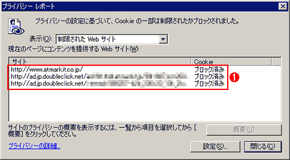

# [cookie][3pca] 3PCA 8 日目: P3P

## Intro

このエントリは、3rd Party Cookie Advent Calendar の 8 日目である。

- 3rd Party Cookie のカレンダー | Advent Calendar 2023 - Qiita
  - https://qiita.com/advent-calendar/2023/3rd-party-cookie

今回は、Cookie2 が失敗した後に、別のアプローチでこの課題に挑んだ P3P を解説する。


## P3P (Platform for Privacy Preferences)

P3P は W3C では 1997 年頃から作業が始まり、2002 年に 1.0 が Recommendation になっている。

- The Platform for Privacy Preferences 1.0 (P3P1.0) Specification (w3.org)
  - https://www.w3.org/TR/P3P/

この仕様の実態は何かというと、「機械可読な方法でプライバシーポリシーを公開できる」というものだ。当時の「機械可読」と言えば、そう、 XML である。

例えば、サーバから以下のようなレスポンスが返ってきたとする。

```http
HTTP/1.1 200 OK
P3P: policyref="http://example.com/P3P/PolicyReferences.xml"
Content-Type: text/html
Content-Length: 1024
...
```

そのレスポンスは以下のようなものになる。

```xml
 <POLICY name="sample"
   discuri="http://www.example.com/cookiepolicy.html"
   opturi="http://www.example.com/opt.html">
   <ENTITY>
     <DATA-GROUP>
       <DATA ref="#business.name">Example, Corp.</DATA>
       <DATA ref="#business.contact-info.online.email">privacy@example.com</DATA>
     </DATA-GROUP>
   </ENTITY>
   <ACCESS><none/></ACCESS>
   <DISPUTES-GROUP>
     <DISPUTES resolution-type="service"
      service="http://www.example.com/privacy.html"
      short-description="Please contact our customer service desk with
                         privacy concerns by emailing privacy@example.com"/>
   </DISPUTES-GROUP>
   <STATEMENT>
     <PURPOSE><admin/><develop/><pseudo-decision/></PURPOSE>
     <RECIPIENT><ours/></RECIPIENT>
     <RETENTION><indefinitely/></RETENTION>
     <DATA-GROUP>
       <DATA ref="#dynamic.cookies">
         <CATEGORIES><preference/><navigation/></CATEGORIES>
       </DATA>
     </DATA-GROUP>
   </STATEMENT>
   <STATEMENT>
     <PURPOSE><individual-decision required="opt-out"/></PURPOSE>
     <RECIPIENT><ours/></RECIPIENT>
     <RETENTION><stated-purpose/></RETENTION>
     <DATA-GROUP>
       <DATA ref="#user.name.given"/>
       <DATA ref="#dynamic.cookies">
         <CATEGORIES><preference/><uniqueid/></CATEGORIES>
       </DATA>
     </DATA-GROUP>
   </STATEMENT>
 </POLICY>
```

結果からは、以下のような情報を取得できる。

- どんな情報が保存されるのか
  - 実名、住所、電話番号、メールアドレス、カード番号など
- その情報を何に使うのか
  - 広告の最適化、サイトの最適化、プロモーション etc etc
- 誰が受け取り、どのくらいの期間保存されるのか
  - サイトオーナー、パートナー etc etc

そして、これを受け取ったクライアントは、ユーザがあらかじめ細かく設定しておいたポリシーと照らし合わせ、満たされていればそのまま閲覧し、満たされなければ警告を出すというものだ。

もちろん、非常に難解かつ長大なので、人間が直接やりとりすることは想定されてない。しかし、このままでは使いづらいので短縮記法が用意されている。

短縮記法は Compact Policy (CP)と呼ばれ、短いため直接 HTTP ヘッダに記述できる。前述の例であれば以下だ。

```http
HTTP/1.1 200 OK
P3P: CP="NON DSP ADM DEV PSD IVDo OUR IND STP PHY PRE NAV UNI"
Content-Type: text/html
Content-Length: 1024
...
```

SOAP をはじめとした XML 全盛時代の、機械可読で自動ネゴシエーションなマナーをそのまま体現したような仕様であることがわかるだろう。


## IE での実装

そして、この夢のような仕様は実際に IE で実装されて、IE6 はブラウザの設定からこの P3P について、ユーザ側の指定をするための項目があった。

これはもう再現方法がないのため、以下のサイトに残っている画像を引用させてもらう。筆者もうっすらしか覚えていない。

- IE 6 のプライバシー管理機能(1/12) - ＠IT
  - https://atmarkit.itmedia.co.jp/fwin2k/experiments/ie6privacy/ie6privacy_01.html

まず、「インターネットオプション」でフィルタリングのレベルが指定できる。③にあるインポートからは、独自のポリシーをインポートできる。おそらく XML が CP が指定できたのだろう。(これってそういう設定だったのか)

![[インターネットオプション]ダイアログの[プライバシー]タブ](ie6privacy016_2.png)

また、サービスが P3P ヘッダでポリシーを提供している場合は、それを見る UI もあったようだ。(見たことない)

![[プライバシーポリシー]ダイアログ(ポリシーが存在する場合)](ie6privacy015.png)

これで、ポリシーに照らしてサイトの P3P が自動的に評価される。もし一致しなかったら、基本的にはサイト自体は閲覧できるが、3rd Party の Cookie はブロックされるという実装だったようだ。



ブロックされた場合は以下のような警告が出る。(アレってそういう意味だったのか!)


思わずインターネット古参会歓喜な内容になってしまった。こうした記事もきちんと維持してくれている @IT には感謝したい。


## P3P の実態

結論から言えば、 P3P も全くと言って良いほど普及しなかった。

まず、仕様が難しいためデプロイが困難なのは言うまでもない。しかし、なによりユーザが理解するのも難しかった。そして、「これによって本当にどれだけ意図したプライバシーの保護が実現するのか」と多くの人が懐疑的だった。その上、やはり当時はまだこれをサポートさせるための法律も特になかったため、積極的に手を出す企業も少なかった。

ところが IE は、「P3P を返してなかったら、ポリシーが確認できないため、どう使われてるかわからないから 3rd Party Cookie は全部無効にする」という強力な制限をデフォルトにしていた。

これは 2000 年初頭の時点で、 3rd Party Cookie をデフォルトで無効にしているブラウザが既にあったことを意味する。

今からは想像できないかもしれないが、当時の IE といえばトップシェアだ。無視することなどできない。それでも P3P が普及しなかったのは、 IE が CP を解釈できなかった場合に、フォールバックとして 3rd  Party Cookie の許可側に倒していた点が大きい。

要するに、何かしら CP を送っておけば、 3rd Party Cookie は使えたのだ。「P3P というコンセプト」は普及しなかったが、「形骸化した P3P ヘッダ」は、3rd Party Cookie を IE でも使いたいサービスには、広く普及していた。

一般開発者にも「よくわからないが `P3P: CP='UNI CUR OUR'` って入れればいいらしい」程度のおまじないとして認識されていたようだ。(この CP はざっくり言うとトラッキングしてないよという意味らしい)。

有名なところで、 Google は以下のような P3P を提供していた。当時の様子を象徴する実装だろう。

```http
P3P: CP="This is not a P3P policy! See g.co/p3phelp for more info."
```


## P3P の終了

IE 以外にも Netscape と Firefox が少し実装したようだが、それもすぐ消えた。他のブラウザは後に「3rd Party Cookie を自己責任でブロックできる設定を載せる方が使いやすい」と続かなかったのだ。(これが今ブラウザの Settings にある 3rd Party Cookie block の設定に繋がる)

以下の 2010 年の調査(卒論?)では、策定から 8 年経っても対応率は数 % だったという結果がある。

- WWW における P3P コンパクトポリシーの利用状況に関する調査
  - https://db-event.jpn.org/deim2010/proceedings/files/D8-5.pdf

後に、MS は「Google が P3P をきちんと守ってない」と非難したところ、Google からは「P3P をいまだにやろうとしているのは MS だけだ」と反撃するといった一幕もあった。

- 今度は Google がマイクロソフトに反論「P3P は時代遅れ」 | RBB TODAY
  - https://www.rbbtoday.com/article/2012/02/21/86533.html

結果、P3P は 2006 年に一応改訂して 1.1 を出したが、ずっと下火のまま 2018 年に作業を終了する。MS 自身も 2016 年にサポート終了を公表している。

- P3P is no longer supported (Windows) | Microsoft Learn
  - https://learn.microsoft.com/en-us/previous-versions/windows/internet-explorer/ie-developer/compatibility/mt146424(v=vs.85)

XML 全盛の時代とはいえ、少し見ただけでも普及は難しそうな仕様だということがわかるだろう。では、もっと簡単な仕様だったら上手くいっただろうか?

ここまで言えば、感のいい人は気づくかもしれない。そう、次回はそのヘッダの話をする。