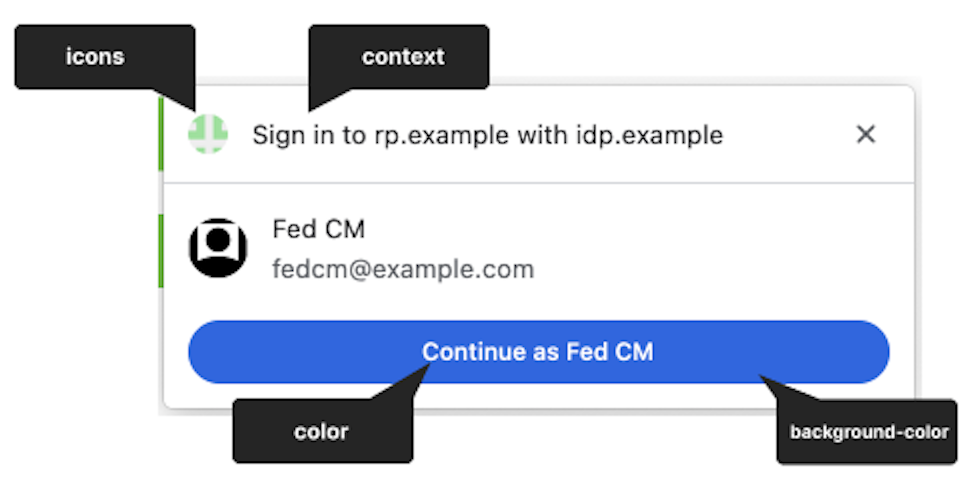

# [cookie][3pca] 3PCA 27 日目: FedCM

## Intro

このエントリは、 3rd Party Cookie Advent Calendar の 27 日目である。

- 3rd Party Cookie のカレンダー | Advent Calendar 2023 - Qiita
  - https://qiita.com/advent-calendar/2023/3rd-party-cookie

今日は、散々壊れるユースケースとして解説してきた「認証連携」をカバーする FedCM について解説する。


## Federated Credential Management

### 認証連携

あるサイト(RP)の認証を、別のサイト(IDP)の認証で行いたい場合、両者の連携は 3rd Party Cookie で行われてきた。

例えば、 RP に `<iframe>` で IDP を埋め込み、 IDP に対するログイン済みの Cookie があれば、その情報を JS で RP に渡して認証済みにするといった構成だ。

これは、 `<iframe>` の中が Partition されているため、 SAA などを使わない限りアクセスできなくなった。 SAA が入る前の ITP 対策としてよく行われていたのは、一旦 IDP のページに遷移し、そこでジェスチャを発生させ、認証結果をクエリにつけて RP にリダイレクトバックする方法だった。詳細は過去の記事で解説している。

これは SSO などでも使われており、 3rd Party Cookie を用いたユースケースとしてはかなりポジティブなものとして捉えられている。


### FedCM API

このユースケースと、関連する認証周りをそのままブラウザ API に落とし込んだ提案として WebID があった、今は名前が変わって FedCM になっている。

- fedidcg/FedCM: A privacy preserving identity exchange Web API
  - https://github.com/fedidcg/FedCM

簡単に言えばブラウザに対して IDP に対するログインの処理を委譲できる。もしログイン済みでなければ IDP のログイン画面を表示し、そこからログインができる。


ブラウザが IDP に対して行うリクエストには Cookie が付与されるため、そのセッションの有無で認証を連携することができるのだ。もしログイン済みなら、そのアカウントをブラウザの UI で表示し、選択することができる。ブラウザのネイティブ UI だが多少はカスタマイズもできる。



これを RP 側で呼び出すには、基本的には JS を多少呼び出せば対応できるため、 RP 側のコストはそこまで高くはないだろう。

```js
const credential = await navigator.credentials.get({
  identity: {
    providers: [
      {
        configURL: "https://idp.example/config"
        clientId: "https://rp.example",
        nonce
      }
    ]
  },
  mediation: "optional"
})
const { token } = credential
console.log({ token })
```

一方 IDP 側は、 FedCM のための `/.well-known` エンドポイントなどを追加する必要はある。既存の実装の上に FedCM とのダンスのための口を追加するような対応が必要になるだろう。


### iframe からの呼び出し

FedCM は `<iframe>` の中からも呼び出すことができる。

```html
<iframe src="https://embedded.example" allow="identity-credentials-get"></iframe>
```

これは、例えば YouTube を埋め込んでいるがログイン済みにならず、課金しているのに広告が出てしまうといったケースをカバーできる可能性がある。

つまり、認証を繋ぐだけであれば、 SAA や CHIPS に頼らずともユースケースを実現できる可能性がありそうだ。

ただ、これがどこまでどういった制限をもっているのかは、正直まだ筆者にもあまりわかっておらず、実際に使っているケースもまだ見てないため、今後検証したい。


## Standard Position

認証連携というユースケースがポジティブに捉えられているため、各ブラウザのポジションも悪くない。

まず Mozilla は Positive だ。

- Mozilla: Positive
  - https://mozilla.github.io/standards-positions/#fedcm

コメントは珍しく長いので引用は割愛する。

次に Webkit だが、まだポジションは決まってない。 FedCM に関する複数のポジションリクエストがあり、コメントもまだあまり付いておらず、態度を保留しているようだ。

- Webkit: N/A
  - https://github.com/WebKit/standards-positions/issues?q=is%3Aissue+fedcm

Apple も "Sign In with Apple" を持っているため、ユースケース自体は認めていると思われる。