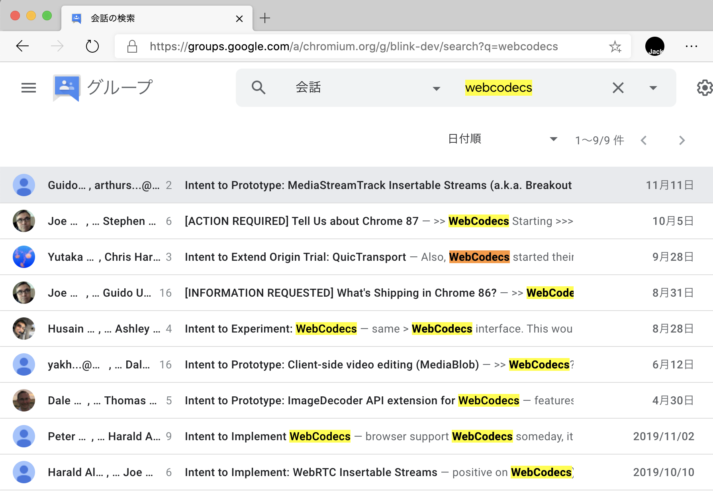
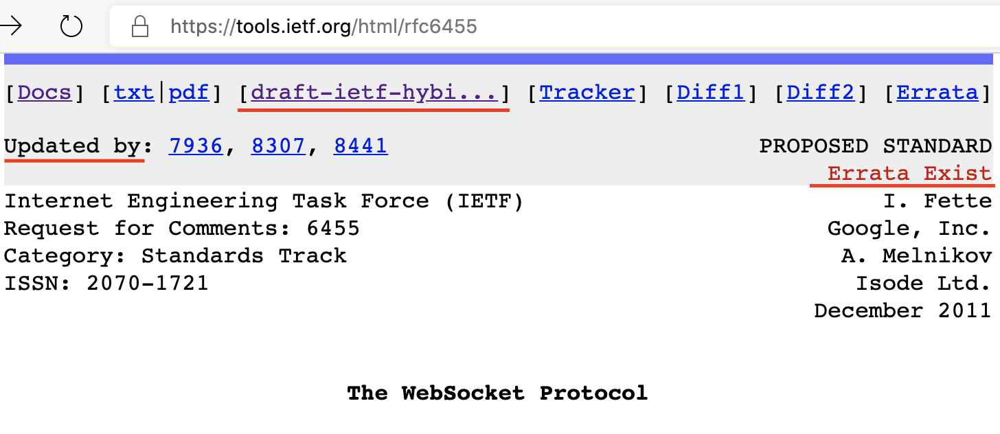
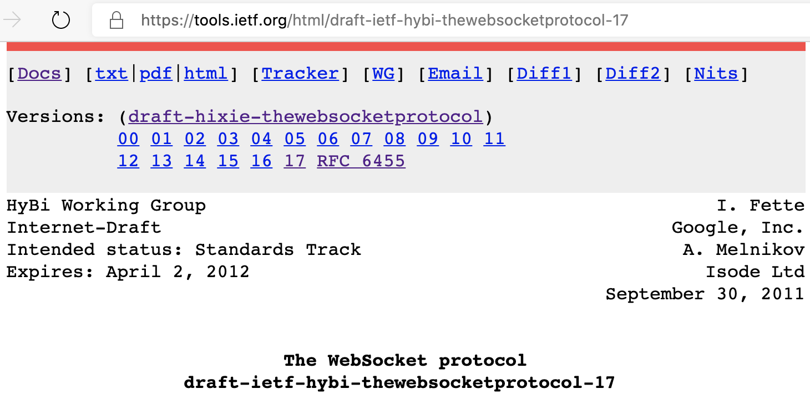
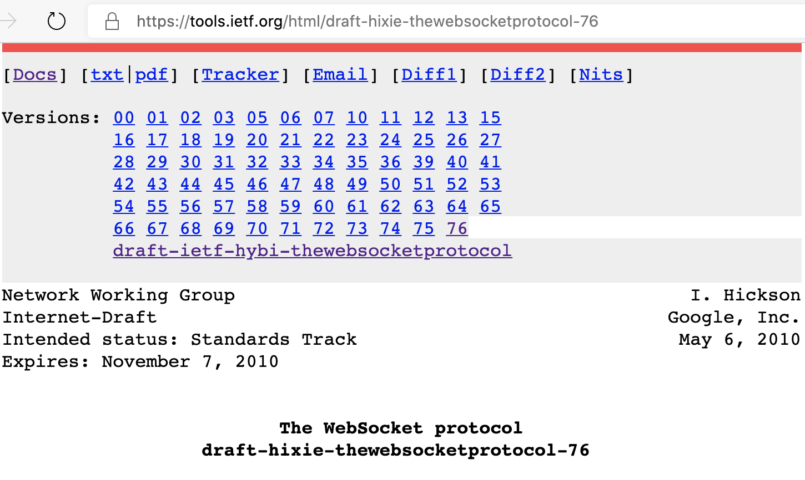

# [monthly-web] Web 技術の調査方法

## Intro

「新しい API などを、どうやって調べているのか」「仕様などを調べる際に、どこから手をつければ良いのか」などといった質問をもらうことがある。

確かにどこかに明文化されていると言うよりは、普段からやっててある程度慣れてきているだけなものであり、自分としても明文化していなかったため、これを気に解説してみることとする。

やり方は一つではない上に、筆者は実務で必要になるというよりは、ほとんどを趣味でやっているため、このやり方が合わない場面は多々有るだろう。

スコープとしては、ライブラリ、ツール、フレームワークなどではなく、 Web プラットフォーム関連の標準やブラウザの実装状況などに限定している。

## Scope

従来からあり広く認知された API については、情報も多いため調査の敷居はそこまで高くないだろう。

今回は、議論が始まって間もない新しめの API になどについて、現時点でどういう状況なのか、仕様の議論はどう進んでいるのか、実装はどうなのか、といった部分を調べる場面、つまり *点で調べる* 場面にフォーカスする。

一方、普段から流れ(トレンドと言っても良い)を把握するという意味で、 *線で調べる* 方法は以前解説した以下が参考になるだろう。

- [Monthly Web の作り方 2018 年版](https://blog.jxck.io/entries/2018-07-18/how-to-logging-monthly-web.html)

<!--
具体的なケースを上げた方が書きやすいので、今回はこのブログで紹介した過去の記事で、実際に行った調査を例に解説する。

- WebCodecs の現状を調べる
- srcset がどういう実装になっているのかを調べる
- CSS のなにか
-->

## 新しい API の現状を調べる

何か新しい API の話題が、主に Google などから出始め、それを調査する必要が出た場合を想定する。

直近だと WebCodecs の記事がそのケースにあたるので、これを例に解説する。

### blink-dev

WebCodecs の場合は、 Google が提案/実装を主導しているため、最初は blink-dev から当たるのがわかりやすいだろう。

- [blink-dev \| Google Group](https://groups.google.com/a/chromium.org/g/blink-dev)

この ML は、主に Chrome のエンジンである blink の開発に関するアナウンスが行われている。

大抵の新しい API は Chrome が何かしら作業をしている場合が多いので、まず blink-dev から当たると何かしら取っ掛かりが得られる。

ちなみに、筆者はブラウザのカスタム検索エンジンとして blink-dev を登録しているので、ブラウザに "blink-dev" と打つだけで検索できるようにしている。

ここで WebCodecs を検索すると関連しそうなスレッドがいくつか見つかる。

まず、これらスレッドのタイトルについている "Intent to ~" という部分が、マイルストーンを示しており、だいたい以下の順で投稿される。

- Intent to Prototype/Implement
  - この機能について実装に着手する
  - 関連するドキュメントや議論に関するリンクがまとめられている。
  - Canary などでは作り途中のものが試せる場合がある
  - 以前は Implement だったが最近 Prototype に名前を変えたのでまだ名残がある。
- Intent to Experiment
  - 実装がある程度形になったのでトライアルを開始する
  - Chrome Dev/Beta でフラグ付きで有効にできる
  - Origin Trials が開始される
- Intent to Extend Origin Trials:
  - Origin Trials を延長する
  - Origin Trials は期限を決めて開始されるが、十分なトライアルが済んでない場合など
- Intent to Ship
  - トライアルで十分にフィードバックが集まり実装も固まったので、リリースする
  - コンセンサス、具体的には他の開発者から LGTM が 3 つが得られれば良いというルール
  - その後 Chrome Stable リリースに入る
- Intent to Deprecate
  - なんらかの機能を非推奨/無効にする
- Intent to Remove
  - Deprecate が完了したためコードを消す

もし該当の機能で何かしらヒットすれば、そこから調査を始めるのがわかりやすいだろう。

WebCodecs の場合は、 Intent to Experiment まで出ているので、実装は進みトライアルが始まろうとしていることがわかる。

- [Intent to Experiment: WebCodecs](https://groups.google.com/a/chromium.org/g/blink-dev/c/7OdxQf5HnlQ/m/oyb3oFVaAAAJ)

また、その中で以下のような情報が入っている。

- Explainer:   <https://github.com/WICG/web-codecs/blob/master/explainer.md>
- Design docs: <https://docs.google.com/document/d/1fw3_aMB0-q9hOMuz_lxE8kEd-Z7vjA0wtklpx77m4yw/edit>
- TAG review:  <https://github.com/w3ctag/design-reviews/issues/433>
- Draft Spec:  <https://wicg.github.io/web-codecs/>

これが調べていく起点となり、 Intents が見つからなかった場合は、仕様のリポジトリなどを探すことになる。

中身を順に解説していく。

## Explainer

新しい仕様が提案されるとき、まず最初に「こんな機能が欲しい」という概要とモチベーションを説明する *Explainer* が最初に作られる。

特に置かれる場所もフォーマットも決まってないため、 Google Docs, Github, Issue, ML, [Discourse](https://discourse.wicg.io/) の投稿だったりすることもある。

いきなり仕様や実装を読むよりも、その仕様の概要を抑えるという意味では、まずこの Explainer を探して読み、概要を把握するのが良いだろう。

WebCodecs の場合は以下だ。

- Explainer: <https://github.com/WICG/web-codecs/blob/master/explainer.md>

## Spec

いわゆる仕様だ。これは IETF なのか W3C なのかによって違うが、ある程度規定されたフォーマットで書かれるのが基本だ。

しかし、決まったフォーマットに落とす前に、例えば API Interface だけを Explainer の延長で Github に書いたりすることもあるので、一概にどこにあるとは言い切れない。

IETF と W3C の場合だけもう少し見方を解説しておく。

### IETF

#### RFC

例えば WebSocket の場合で見てみよう。 WebSocket は既に RFC になっており RFC6455 がそれにあたる。

- https://tools.ietf.org/html/rfc6455

RFC が出ていればそれを読めば良い。が、読み始める前にかならず確認すべきヘッダが 3 つある。

- Errata Exist
  - Github でいう Issue ページ、RFC が出た後に見つかった誤字脱字や仕様のバグなどが報告されている。
  - RFC 自体は一度出たら修正されないので、ここに Errata が溜まったら、別の RFC として更新版が出るが、なかなか出ないものが多い。
  - 特にこれから実装しようとか、仕様の細部を確認するような場合はかならず確認するべき。仕様が常に正しいとは限らない。
  - 逆に仕様で間違ってたり誤字脱字を見つけたらここから報告する。
- Obsolute by
  - このリンクがある場合は、この仕様の改訂版があり、それによりこの仕様が古くなったことを意味する。
  - 基本は最新版を見ればよい。
- Updated by
  - Obsolute ではないが、部分的に改定した RFC があることを示す。
  - RFC6455 WebSocket の場合は、 RFC8443 Bootstrapping WebSockets with HTTP/2 などが Update している。

RFC のヘッダ部分の赤線部をクリックすると過去のドラフトのリンクに飛べる。

これが WG Draft だ。

#### WG Draft

- https://tools.ietf.org/html/draft-ietf-hybi-thewebsocketprotocol-17

これは、 WebSocket を策定する Working Group である Hybi (hypertext bidirectional) で議論された RFC になる前のドラフトだ、バージョンが 00 ~ 17 まであり、 18 相当が RFC になったことがわかる。

URL を見ると、 IETF の hybi が策定している the websocket protocol の v17 であることが読み取れるだろう。最後のバージョンを省略すると自動で最新にリダイレクトされるので、古いドラフトのヘッダは更新されないことがあるので、最新を見たいときは一度リダイレクトすると良い。

#### 個人 Draft

そのヘッダ部分には、更に古いドラフトへのリンクがある。

- https://tools.ietf.org/html/draft-hixie-thewebsocketprotocol-76

これは、 Hybi WG で議論する前に WebSocket の最初のデザインを書いた Hixie (Ian Hickson) 個人のドラフトだ。

このようにドラフトは最初個人が 76 回の更新を重ねた結果、 Hybi という WG のアイテムとして議論しようということで

## Design Docs

Chrome の場合、実装に着手する前に、どういう方法で実装を入れる予定なのかを Design Docs という形でまとめることが多い。

これがレビューされてから実装に着手することになるので、作られる場合は Intent to Prototype の時点では用意されているだろう。

ただ、この内容は実際に実装を行う上での話、つまり C++ での設計の話が中心なので、よほど細かい点を調べる必要でもない場合は、あまり見る必要は無い。

筆者がやっている Podcast である [mozaic.fm](https://mozaic.fm) の中で、 Monthly Web という月ごとの Web の動向をまとめる回をやっている。

その作り方のまとめを作ってからちょうど二年たった。

大枠は変わってないが、更新もあるため、現状を再度まとめる。

前回のを読んでなくてもこの記事だけで完結するよう、差分ではなく重複を含め全て書く。

## Monthly Web

mozaic.fm は、 Web について「*今何が起こっているのか*」「*これからどうなっていくのか*」を議論するための Podcast である。

そこでは、ゲストをお呼びし、特定のテーマについて議論をするということを行ってきた。

しかし、このテーマの設定と消化よりもよほど早い勢いで、多くの重大なトピックが日々生まれており、その大局的な流れを扱うことはできないかずっと考えていた。

通常回が「*縦を深く掘る*」議論であるとすれば、「*横の流れを繋ぐ*」部分の議論を行うことができれば、議論するコンテキストをより補完することができるだろう。

そこで、月に 1 度その月の流れをまとめるということを始めた。

目的は速報ではないため、単なるニュースのまとめをするというよりも、そこまでにあった流れをまとめながら *Web のスナップショット を取っていく* ようなイメージだ。

最初の数回はブログで行っていたが、単なるリンク集にしかならないため、コンテキストを補完するために Podcast に移行した。

最初の公開で、当時のモチベーションをまとめている。

[ep25 Monthly Web 201707 \| mozaic.fm](https://mozaic.fm/episodes/25/monthly-web-201707.html)

ゲストは [@myakura](https://twitter.com/myakura) にお願いし、毎月付き合ってもらっている。

こうした内容で頼める人はなかなかいないため、感謝しかない。

## 対象

基本的には、 *仕様の変化* と *実装の変化* の 2 つの側面に絞り、一次情報を取り出すことにした。

仕様は IETF, W3C/WHATWG/WICG, TC39 を中心とし、実装は Chrome, Firefox, Safari, Edge の 4 ブラウザを主とした。

それ以外に、 Web に関わるセキュリティ系(インシデント, CVE, 新しいヘッダや API etc)の話題はセキュリティ動向にまとめ、それ以外は周辺動向にまとめている。

また、今後何があるのかを把握するため、主要なイベントをまとめている。

最後に、毎年年末に行う Yearly Web で一年を総括するが、毎回一年分を振りかえって準備するのが大変なため、 Wrap UP をトークの最後に書くようにした。

現在の TOC は以下のようになっている。

- 実装の変化
  - Chrome
  - Firefox
  - Safari
  - Edge
- 仕様の変化
  - WHATWG/W3C/WICG
  - TC39
  - IETF
- その他動向
  - セキュリティ動向
  - 周辺動向
  - イベント
- Wrap UP

各動向のまとめ方などについて記す。

## Chrome 動向

### Overview

もともと、 Chrome Blog, Chromium Blog, AMP Blog, WebMaster Blog など、アウトプットが充実していたが、最近は Web.Dev が非常に高い頻度で更新されるため、とてもではないが全部は追えないような状況にある。

現状は、 Chrome Blog/Chromium Blog の主要アウトプットは含め、 Web.Dev はリストだけしておき気になるのをピックアップする程度に絞り、他は殆ど入れていない。

Chrome の実装に関する情報は、引き続き blink-dev に Intent として投稿され、実装状況はそこで追うことができる。最近このあたりはかなり整備が進んでいるため、以前よりも投稿フォーマットの正規化が進みつつある。

大きなイベントとしては、 Google I/O, Chrome Dev Summit, BlinkOn があるが、今年は Google I/O が無かったため、代わりに Web.dev Live が開催された。

内容は大半 web.dev の記事でカバーされているので、イベントの後に大量の動画を見る必要もあまりなかった、この流れは今後も続くかもしれない。

とにかく、他のベンダと比べて、アップデートの相対流量が増える一方なため Monthly Web の中では半分は Chrome 周りの話をしている状態になっている。

本当は他のトピックとも均等に時間が割けると理想だが、流量の比率がそのまま Monthly Web 内の比率になっているためこの状況は変わってない。

### Updates

### Intents

実装の進み具合については、 blink-dev ML の Intents を追うのが一番手軽だ。

- <https://groups.google.com/a/chromium.org/forum/#!forum/blink-dev>

例えばある機能 A の実装に着手する場合は "Intent to Prototype" という投稿があるといった具合だ。

(以前は Intent to Implement というタイトルだったが徐々に Prototype に置き換えられている)

Intents は以下のようなバリエーションがある。

- Ship: (Stable に Ship する)
- Prototype: (実装に着手する)
- Prototype & Ship:
- Experiment: (OriginTrial などでフィードバックを集める)
- Change: (仕様への整合などで変更を入れる)
- Unship: (仕様やセキュリティ的な理由で無効化する)
- Remove: (所定のプロセスを経て消せる状態になった機能を削除する)

Intents を追うことで、「この機能は実装できるところまで仕様が仕上がったんだな」「Origin Trials 始まったな」「そろそろリリースか」などといった部分がわかる。

また、本文にはモチベーションや仕様へのリンク、他ブラウザのシグナルなどもまとまっており、フィードバックのレスもつくため、議論も追いやすい。

こうした Chrome での実装状況は、 Chrome Platform Status でまとめられていたが、今後は他のブラウザの Status もここに統合され、 Web Platform Status として使われるという話もあるので、機能から状況をたどる上ではここが良いエントリーポイントになるだろう。

- <https://chromestatus.com/features>

### Events

Web に関わる大きめのイベントとしては、 Google I/O, Chrome Developer Summit, Blink-On などがある。

Web 自体は製品ではないため、 I/O で知る内容は Chrome の新機能や Google が推したい分野がどこなのか、が多い。

最近、 Android や GCP など大きめなトピックは、 I/O とは別で独自のサミットをやりはじめ、その流れもあってか Web も DevSummit や Blink-On の方が細かい話が多い。

同様に Polymer や AMP なども、独自のサミットを開催する場合があり、細かいものを含めるとイベントは結構多い。

スライドや録画が出た時に、気になるものだけまとめている。

### Team Snippet

もう流れてこなくなったので、この節は消えた。(今思い出した)

### Release Blog

実装された機能は Canary, Dev, Beta を経て Stable リリースされる。

リリーススケジュールは以下で確認できる。

- <https://www.chromestatus.com/features/schedule>
- <https://chromereleases.googleblog.com>
- <https://www.chromium.org/developers/calendar>

Beta あたりまで来ると、アップデートエントリが Chromium のブログに来る。

- <https://blog.chromium.org>

ここで、 Intents の結果、次の Stable に入るおおよその変更が把握できる。

Stable リリースのタイミングでは、 "New in Chrome" と "Deprecation & Removables" エントリが Google Developers Blog にあがる。

- <https://developers.google.com>

(Intents から追っていると、数カ月間その議論を追うことになり、知らぬ間に「もう普通に使えるもの」と錯覚してしまうことがあるため、 Stable リリースで認識を補正する必要がある)

ここまでは、主に標準寄りの実装に注目しているため、 Chrome 自体の新しい機能の解説や、挙動の変更などに関しては、別途エントリでフォローする。

ブログは後に日本語翻訳されることもあるが、原典で扱っているため含めていない。

### V8

V8 も、アップデートのタイミングでブログがあがるため、これも含めている。

- <https://v8project.blogspot.jp>

ES API の実装状況だけでなく、内部のパフォーマンス改善などの解説も面白い。

### Other

他にも気になるものがあれば Other にまとめている。

AMP や Firebase でも、気になるアップデートがある場合は混ぜることもある。

- <https://chromestatusdeck.com>
- <https://security.googleblog.com>
- <https://www.chromestatus.com/features>
- <https://amphtml.wordpress.com>

## Firefox 動向

### Overview

Chrome に次いでアウトプットが多い。

Bugzilla の流量が多いが、全部追うのは時間的に厳しいため、 Intents や Release Note でカバーしている。

Intents は Chrome と似た運用だが、カバー率が低く Intents なしでリリースされることもあるように思う。

リリースは 2 ヶ月ごとくらいに行われ、 ESR が運用されている。

- <https://wiki.mozilla.org/RapidRelease/Calendar>

ブログでは Web だけでなく Internet の話題、例えば NetNeutrarity なども積極的に出してくるが、政治や法律などレイヤの高い話題は Monthly Web では省いている。

### Intents

Chrome と同じような Intents が運用されている。

Intents のカバー率は低いように感じるが、やはりそこが一番手軽だ。

- <https://groups.google.com/forum/#!msg/mozilla.dev.platform>

Experimental な機能は以下にまとまっている。

- <https://developer.mozilla.org/en-US/Firefox/Experimental_features>
- <https://platform-status.mozilla.org>

### Release Blog

リリースのスケジュールなどは以下にある。

- <https://www.mozilla.org/en-US/firefox/releases>
- <https://wiki.mozilla.org/RapidRelease/Calendar>

リリースノートは以下にある

- <https://developer.mozilla.org/en-US/Firefox/Releases>

メジャーアップデートなどは、以下のブログにエントリが出る

- <https://blog.mozilla.org>
- <https://hacks.mozilla.org>

Nightly News には、 "These Weeks in Firefox: Issue NN" というシリーズのエントリが上がり、 Nightly で進行している実装の進捗などがまとまっている。

濃く長いことが多いため、全部読めない月も多いが、 Highlight を眺めるだけでも次の Stable で入りそうな変更などが伺える。

Intents や Snippet のまとめ的な意味合いで、情報濃度が高い。

- <https://blog.nightly.mozilla.org>

### Site Compat

互換性に関わる変更がある場合 sitecompat というサイトが更新される。

- <https://www.fxsitecompat.com>

ボランティアベースではあるが、 Intent to Remove 系との関わりや影響が確認できる。

古くからある機能の削除や、挙動変更のアナウンスで「そんな機能あったのか」と知ることが多い。

### Event

Mozilla の場合は一番目立つのは Mozilla Festival だろう。

- <https://mozillafestival.org>

Web に限らず Decentrarization や Net Neutrality といった、レイヤの高い話も多い。

Web についても、 Web Literacy や HTTPS Everywhere のような啓蒙が多いイメージがある。

Update は medium で行われている。

- <https://medium.com/mozilla-festival>

### Other

最近、新しい仕様などに対して Mozilla がどういうスタンスを取るのかという、表明がまとまったページができた。

- <https://mozilla.github.io/standards-positions>

ここを見ると、まだ Intent も出ていない仕様がどうなりそうかが、なんとなくわかる。

Github に issue を上げると、それについて表明を追加してくれるため、「あの機能はどうなんだろ」と思ったら投げて見ると良い。

他にも Mozilla は広い視点で示唆に富んだブログがあがることが多いため、必要に応じてフォローしている。

## Safari 動向

### Overview

Safari 自体のメジャーアップデートが年 2 回しかないため、基本は Technology Preview を追うことになる。

普段のアウトプットが Chrome, Firefox などと比べて少ない分、 WWDC なども面白いセッションがぽろっと出たりする。

Technology Preview よりも、もう一段粒度の細かい Intents 的なアウトプットがあると助かるなとは思うが、そうなるとコミットログを全部追うしかない。

### Safari Technology Preview NN

Technology Preview は、不定期(月 0~3 回程度?)にリリースされ、そのブログが主な情報源となる。

- <https://webkit.org/blog>
- <https://developer.apple.com/safari/technology-preview/release-notes>
- <https://developer.apple.com/library/archive/releasenotes/General/WhatsNewInSafari/Introduction/Introduction.html>

TP では、仕様の早い段階の実装が突然入ったり、ドラフトすらない実装がいきなり入ったりと、若干ハイコンテキストなときもある。

(Cross-Origin-Resource-Policy など)

しかし、 TP の変更点にはチェンジセットへのリンクが含まれるため、気になるところはそこから補完できる。

これがあるため、チェンジセットをつぶさに追う負荷が下がり、助かっている。

### ChangeSet

Intents などが細かく出ないため、チェンジセットを追う必要がある場合もある。

気になる機能の動向は、担当している人を把握し、その人のアクティビティを追う感じになるだろう。

- <https://trac.webkit.org/timeline>

### Blog

Safari 特有の実装や、割と細かい機能解説、中の人がみなぎった結果出てきた論文のような文書など、色々とブログがあがるので参考になる。

- <https://webkit.org/blog>

逆を言えば ITP などは、このブログくらいしか表立ったアウトプットが無く、その次はソースコードレベルとなる場合もある。

Chrome ほどガイドライン的なドキュメントが整備されていないので、ブログの重要度は高い。

ブログにはコメント欄が無いため、 Twitter で [書いた人](https://twitter.com/jonathandavis) や、 [答えてくれそうな人](https://twitter.com/rmondello) に質問をしている光景をよく見る。

そのため、派生した議論が Twitter に散らばり、ここを追うのが面倒だったりする。

### Event

中心は WWDC になり、他のイベントにくらべて一番注目されているように思う。

大抵夜だが、朝起きると各メディアや個人がこぞってブログを書いているため、追う負荷は一番低い。

Web にかかわるアウトプットは少ないが、 Safari のアップデートの話がたまに混ざる。

他に Apple 主催で Web に関わるようなイベントは把握していない。

綱島にも拠点ができると聞いた時は多少期待したが、特にローカルイベントなどが主催された様子はないので残念だったりする(行って見たい)。

### Other

主催イベントやアウトプットの場、アドボケートのような専任が少ないため、アウトプットが少ない。

しかし逆を言えば、 Technology Preview や Blog に集約される点で、追う場所が限定的なため、そこを見ていれば良いという楽さはある。

最近は、とにかく Tracking を許さないという強固な態度や、新機能を入れるよりはパフォーマンス改善を優先すると言った、他のブラウザと比べて特徴のある方針を取ることが多い。

標準化の場面でも Template Instantiation や CSS Everioment Variable などを率先していたりと、面白い動きも多い。

## Edge 動向

### Overview

近年アウトプットの場も量も増えているが、全体的には追いにくい印象がある。

特にリリースやそれにまつわるアップデートが  Windows とまとめられがちなため、 Windows のアップデートもある程度追う必要がある。

大きなイベントに MS Build があるが、 Web の話はあまりない印象。

IE のアップデートはあまりないが、あればここに含んでいる。

### EdgeHTML

基本は EdgeHTML というエンジンのバージョンアップを追うことになる。

全体的なアップデートのブログは以下に投稿される。

- <https://blogs.windows.com/msedgedev>

EdgeHTML のアップデートは、 Dev Guide というページの What's New のトップに一番新しいバージョンが載る。

- <https://docs.microsoft.com/en-us/microsoft-edge/dev-guide>

古いバージョンは What's New の中にバージョン付きのリンクができる。

- <https://docs.microsoft.com/en-us/microsoft-edge/dev-guide/whats-new/edgehtml-16>

これでは、最新のものに Deep Link が貼れないが、以下の短縮 URL は目的のものにリダイレクトされるため、これを使っている。

- <https://aka.ms/devguide_edgehtml_17>
- <https://aka.ms/devguide_edgehtml_16>

ここでは、アップデートに関する解説と、 Preview Build ごとの API 単位の変更を Code Pen で埋め込んで表示している。

(個人的には、もう少し見やすくまとめられないのかなと思う、いかにも MS らしいレイアウトになっている)

### status updates

Intents が無い代わりに、現時点での Status がまとまったページがある。

- <https://status.microsoftedge.com>

ステータスは以下がブラウザごとに書かれている。

- Supported
- Preview build
- In development
- Under consideration
- Deprecated
- Not currently planned

このページはその時点でのステータスしか出ず、変化の部分は取れない。

(おそらく、細かく変更を追う人よりも、今の時点で使えるのか使えないのかを知りたい、というユーザが多いのでは無いかと推測)

幸いにも、ここのソースが github で管理されているため、 Monthly Web では更新を 1 ヶ月分出してまとめている。

- <https://github.com/MicrosoftEdge/Status/compare/production@{2018-07-01}...production@{2018-08-01}>

ちなみに、実装されていない機能については、ここから Vote することで要望できる。

### Build Changelog

Edge は Windows の build に紐づいており、 Windows の build は以下から build 番号で追う。

- <https://developer.microsoft.com/en-us/microsoft-edge/platform/changelog>

build 番号を選ぶと、その先のページで、 Edge に関する更新がまとまっている場合がある。

もしそのページになくても、ページ右側にある以下の部分に、ブログへのリンクがある。

> Learn more about this release on the Windows blog

ここから build ごとのリンクに飛ぶと、より細かく書かれている場合がある。

そのブログのトップは Windows Experience Blog になっている。

- <https://blogs.windows.com/windowsexperience>

このあたりが結構迷子になるが、とりあえず主要な Feed の URL を押さえておけば良い。

### Chakra

Chakra Core 自体のアップデートはリポジトリを見るのが一番良いだろう。

- <https://github.com/Microsoft/ChakraCore>

Chakra Core だけのブログは無く、 Edge のアップデートブログに含まれている。

### IE Support Team Blog

Monthly Web のソースの中で、唯一の日本語ソースである。

元々は IE/Edge の「累積的なセキュリティ更新プログラム」があるため追っていた。

しかし、 IE ユーザからの様々な要望に対して回答をするエントリがたまにあがる。

そこでは、いまだに IE を中心としたエコシステムのリアルが垣間みえる。

- <https://blogs.technet.microsoft.com/jpieblog/2018/02/09/ie11-shortcut-key>

最近味わい深かったエントリの一文を抜粋しよう。

> 昨今では各ベンダーより様々なブラウザーが開発され、ユーザーが利用するブラウザーの大半が Internet Explorer だという時代は残念ながら過ぎ去ってしまっています。
> このような背景から、最近では Web サイトにおいても「相互運用性」という点が非常に重要になってきました。
> 「相互運用性」とは、どのブラウザーで閲覧しても、同じように表示する、同じように動作する、同じような体験ができる、というようなことを言います。
> ---<cite><https://blogs.technet.microsoft.com/jpieblog/2018/02/09/ie11-shortcut-key></cite>

### Other

MS も、最近は Cloud や AI 関連が重要視されていると見え、バジェットやリソースは少なそうに思える。

そのためか、大枠の方針などに関するアウトプットは、 Google などに比するとやはり少ない。

Edge の中の人の、新しい機能へ追従するモチベーションは高いと思われ、そちらはアウトプットがある。

また、 Microsoft や Windows の Web サイトで、何かしらを探したり追ったことがある人ならわかると思うが、構造が複雑で迷子になりやすく、レイアウトも見やすいとは言い難い。

後発である Edge も、単体ではなくしっかり Windows に含まれているため、その複雑さをそのまま継承している。

Edge の追い方については未だに慣れない。

## WHATWG/W3C 動向

### Overview

主に、 Draft を更新する複数の Working Group があるため、それらアクティビティを ML などで追うことになる。

最近は github も多用されているため、 ML の流量が無いものも多い。

イベントとしては年 1 回の TPAC と、その周辺で開催される F2F が多い。

W3C 自体は会員制だが、多くの情報はパブリックにされるため、困ることはあまりない。

日本も慶応大学に W3C の拠点があったり、会員企業に属する人も多いため、国内向けにフォアードされるアウトプットも少なくない。

### Draft

W3C のドラフトには以下のようなステージがある。

- Recommendation
- Proposed Recommendation
- Candidate Recommendation
- Working Draft
- First Public Working Draft

ステージが変わるとアナウンスが出る。

- <https://www.w3.org/blog/news>

このステージ変更が 1 つのチェックポイントとなる。

しかし、 Recommendation になるのは、体感として使えるようになるよりも後になることが多い。

したがって、どちらかというと FPWD など、新しめのドラフトの作業に注目することが多い。

一方 WHATWG で Living Standard としてメンテナンスされているものは、ステージを持たないため、コミットを見ることになる。

WHATWG 側で作業されているスペックは以下にまとまっている。

- <https://spec.whatwg.org>

多くは github で管理されているため、スペックにリンクされているリポジトリを追えば良い。

全てのリポジトリのコミットを見ると github の通知が辛いため、 RSS で見るか、最近はそれを垂れ流すだけの Twitter アカウントもあるので、それを見るのが良いのかもしれない。

- [compatstandard](https://twitter.com/compatstandard)
- [consolelog](https://twitter.com/consolelog)
- [encodings](https://twitter.com/encodings)
- [fetchstandard](https://twitter.com/fetchstandard)
- [fullscreenapi](https://twitter.com/fullscreenapi)
- [htmlstandard](https://twitter.com/htmlstandard)
- [infrastandard](https://twitter.com/infrastandard)
- [mimesniff](https://twitter.com/mimesniff)
- [notifyapi](https://twitter.com/notifyapi)
- [storagestandard](https://twitter.com/storagestandard)
- [streamsstandard](https://twitter.com/streamsstandard)
- [thedomstandard](https://twitter.com/thedomstandard)
- [urlstandard](https://twitter.com/urlstandard)
- [w3cmemes](https://twitter.com/w3cmemes)
- [WHATWG](https://twitter.com/WHATWG)
- [xhrstandard](https://twitter.com/xhrstandard)

### Mailing List

Working Group は非常に多く、その全てを追うのは難しい。

個人的には、以下のような ML を見ることが多い。

- [public-new-work](http://lists.w3.org/Archives/Public/public-new-work)
- [public-html](http://lists.w3.org/Archives/Public/public-html)
- [public-ortc](http://lists.w3.org/Archives/Public/public-ortc)
- [public-webappsec](http://lists.w3.org/Archives/Public/public-webappsec)
- [public-webassemly](http://lists.w3.org/Archives/Public/public-webassemly)
- [public-webplatform](http://lists.w3.org/Archives/Public/public-webplatform)
- [public-webrtc](http://lists.w3.org/Archives/Public/public-webrtc)
- [public-houdini](http://lists.w3.org/Archives/Public/public-houdini)
- [public-webauthn](http://lists.w3.org/Archives/Public/public-webauthn)
- [www-style](http://lists.w3.org/Archives/Public/www-style)
- [ietf-http-wg](http://lists.w3.org/Archives/Public/ietf-http-wg)

ML には標準化に関する提案、議論、 Meeting の Minutes などがあがるため、ここが全てとも言える。

public-webauthn や public-ortc のように、 github のアクティビティを連携して流す ML もあるが、単に流量が多くなるだけなので、個人的にはやめてほしい。

### News Blog

W3C 全体での出来事については、以下のブログが更新される。

- <https://www.w3.org/blog/news>

ここでは、最初に述べた Draft の Status Update や新しい Working Group の設立、 Chartering (方針や目的の変更) などといった情報が得られる。

たまに W3C 自体が特定の問題や動向などについてエントリを出すこともあるが、ここを見て入ればそういう情報も入ってくる。

### Tag Review

W3C には、選挙によって選ばれる TAG というグループがある。

TAG は、各 WG が議論した仕様について、 Web 全体の互換性や安全性を損なわないかといった大局的な観点からレビューを行うタスクがある。

そのタスクが実行されいるのが design-review というリポジトリで、ここに issue で Review がリクエストされ TAG のメンバーがコメントする。

- <https://github.com/w3ctag/design-reviews/issues>

新しく提案されている仕様に対する、セカンドオピニオンが見られるため、仕様をより深く理解できる。

どう考えても量に対して TAG が足りて無い気もするが、こうした作業ができるエキスパートも限られているため、止む無いところがある。

TAG の選挙権は W3C 会員にしか無いが、日本の W3C 会員は選挙に対して無関心な票もあるようなので、是非その票の重要性に気づいて欲しい。

### Event

基本は ML で議論されるが、年一回集まる TPAC はやはり重要性で、ここでの議論は Minutes として各 ML などに投稿される。

合わせて、プレゼンをした人の資料が多くあがるため、議論の状況を知る上で重要なチェックポイントとなる。

TPAC への参加は、基本 W3C 会員しかできないため、自身の所属する企業が会員でなければ資格が得られない。

ただ WG で活動している人は、 Invited Experts という枠で参加できる場合がある。

この枠の有無や厳密な運用はよくわかってないため、会員でないがどうしても参加する必要がある人は、 WG の人に相談してみるといいのかもしれない。

また、各 WG が必要に応じて F2F をやっており、それらの情報も WG の ML から入ってくる。

他にも様々なイベントが催されており、 News Blog を見て入れば知ることができる。

### Othre

W3C は歴史も長く、組織やプロセスが枯れているため、かなりシステマチックだ。

そのため、一度追い方と追う対象が決まれば、自然に情報が入ってくる流れが作れる。

最近では github などに議論の場を移しているものもあるが、基本は気になる ML と [news](https://www.w3.org/blog/news) を追えば良い。

全体が把握できないほど大きく、 WG も多岐に渡るため、とにかく興味分野に絞ることと、その ML の雰囲気を把握することが重要だ。

## TC39 動向

### Overview

基本的には提出された Proposal を議論し、奇数月に実施される Meeting で Stage が上がる Stage 制を取っている。

新しい Proposal を把握しておき、 Meeting ごとの Stage の変化を追っていく感じになる。

github が中心の文化であるため、一番入りやすいかもしれない。

### Stage

Stage は 0~4 があり、大まかに以下のよう意味を持つ。

(詳細: <https://tc39.github.io/process-document>)

- 0: Strawman (最初の提案、アイデアレベルでも良く割とカジュアルに提出できる)
- 1: Proposal (ユースケースやモチベーションなどを詰め、 Polyfill などが作られる)
- 2: Draft (仕様のフォーマットを整え、ブラウザの Experimental 実装などが求められる)
- 3: Candidate (仕様が固まり、実装者からのフィードバックなどで細部を慎重に詰める)
- 4: Finished (ECMA262 に正式に取り込まれ、実装も Ship される)

Stage 0 は以下にあり、毎月このリストの差分を見ることで、新しい提案を知ることができる。

細部が無いかわりに、趣旨が把握しやすく、内容も多岐に渡るので単純に面白い。

- <https://github.com/tc39/proposals/blob/master/stage-0-proposals.md>

stage 0 で終わるものもある。

### Event

Meeting は奇数月の月末に実施され、そこで Proposal に対して議論が行われる。

Minutes が出るのは翌月になることが多いので、 Monthly Web では偶数月に前月の Meeting を扱っている。

- <https://github.com/tc39/agendas>

Minutes は長いが、 Proposal に対する Slide などがまとめられるため、ざっと見ておくだけでもだいぶ動きがわかる。

なお、この Meeting は基本的に TC39 の人しか参加できず、ごく稀に招待される人以外は参加できない。

### Stage Update

Stage のリストは以下にまとまっている。

- <https://github.com/tc39/proposals>

なので、一ヶ月分の履歴を見ると、その推移がわかる。

- <https://github.com/tc39/proposals/compare/master@{2018-01-01}...master@{2018-02-01}>

Meeting が無い月は、変更はあまりない。

### Other

Proposal はかなりカジュアルに提出され、 Proposal ごとのリポジトリで議論が行われることもある。

その Proposal の出現は、先に twitter などでアナウンスされているようなので、その出現は気づきにくいものもある。

しかし、最終的に tc39 のリポジトリに集約されるため、そこを見ておけば良いという点で、追うのは非常に楽だ。

組織としての TC39 自体は、 IETF や W3C などと比べると規模も小さく、そこまで枯れた運用がされているという感じではない。

例えば、 Stage 運用(特に Stage が上がる部分)もあまり厳密な感じではないように見えるし、 Meeting も TPAC 以上に閉じている雰囲気がある。

一方 Minutes は細かく整理されているので、トラッキングはしやすく、その点は助かる。

## IETF 動向

### Overview

かなり枯れたプロセスをもっているが、慣れは必要。

基本は ML の議論と、 Draft のアップデート、年三回開催される IETF 会議での Minutes を追う。

WG ごとの F2F や Interop もよくあるため、それらも含めると毎回かなりのアプデートがある。

基本が Internet (物理層以上)全般を扱う場所であるため、 Monthly Web には httpwg や quicwg などに絞って載せている。

### Draft

IETF では、ドラフトの提出が通知される RSS がある。

- <https://tools.ietf.org/html/new-ids.rss>

バージョンの `-00` (たまに `-01`) が新しいドラフトであるため、ここで新しいドラフトの出現が把握できる。

そこからバージョンが上がっていくが、全てを記載すると量が多すぎるため、 Monthly Web では、以下のようなチェックポイントの場面で記している。

- RFC
- IETF Last Call
- WG Last Call
- Call for Adoption
- I-D Action
- Draft(00/01)

### ML

WG は多岐にわたるが、 Web に関連するようなものは、以下のような WG から採用することが多い。

- <https://tools.ietf.org/wg/httpbis>
- <https://tools.ietf.org/wg/quic>
- <https://tools.ietf.org/wg/tls>
- <https://tools.ietf.org/wg/rtcweb>
- <https://tools.ietf.org/wg/acme>
- <https://tools.ietf.org/wg/oauth>
- <https://tools.ietf.org/wg/doh>

最近は draft のリポジトリの方でも議論がある。

しかし、ある程度進むと issue へのリンクと議論のサマリが ML 側に再投稿されることもあり、やはり ML が中心と言える。

### Event

IETF は、チケットさえ買えばだれでも参加できるという点で、 TPAC, TC39 Meeting に比べ一番参加する敷居の低いイベントだ。

やることは TPAC などと同じように、 WG ごとに集まって議論をするのだが、 Mic Queue や Hum など独自の文化がある。

地理的に遠い場合はリモートからの参加も可能で、ビデオチャットから発言したり、チャットからだれかに代理で発言してもらったりということも可能だ。

議論については、 Meeting 前に出る Agenda を眺めておき、終わった後の Minutes を追うのが中心になる。

他にも、期間中に行われるプレナリーやハッカソンなどもアウトプットが出る場合がある。

ちなみに、初参加者には IETF 自体のビギナーセミナや、 New Commer シールなど、初心者へのフォローも充実している。

何年かに一度、開催が日本になることもあるので、参加してみると面白いと思う。

## セキュリティ動向

このセクションは、次項の周辺動向の中で、セキュリティ系の話題が多くなってしまったため分離したものである。

特に最近では以下のようなものが多い。

- CA insident や証明書周りの動向
- Browser/Openssl など実装脆弱性 (CVE)
- セキュリティ対策ヘッダ(CSP etc)
- セキュリティやプライバシーによるブラウザの挙動変化
- 大きめのインシデントや関連事件
- etc

他にも、気になるものについては上げているが、特にソースを固定はしていない。

## 周辺動向

ここまでで入らなかったもので、ソースも固定せず、気になったものを上げている。

大きめのサービスの Web に関する動向、様々な場所で発生した議論や、気になる blog などを含む。

ライブラリやフレームワーク、ツールの更新などは、全部入れているとキリがないので、標準に関わる大きめの話題に限定している。

気をぬくとここが一番多くなるため、意図的にかなり絞っている。

## イベント

ここまでにあげたような、 Web に関わる大きめのイベントをリストしている。

もともとは、あとでフォローするのを忘れないようにやっていたが、ここの更新は気まぐれになりがちなところがある。

## Yearly Web

せっかくなので、年末は一年分の振り返りを簡単におこなってみようと、去年の 12 月は Yearly Web として収録した。

- [ep32 Yearly Web 2017](https://mozaic.fm/episodes/32/yearly-web-2017.html)

2017 年の年末は、 12 月分とその年の振り返りを両方混ぜて収録した。

本当は、もう少し細かく振り返りながら別で収録するのも良いかもしれないが、年末は忙しいのでどうやるかは試行錯誤中でもある。

## まとめ

自分が普段読み流していたものを、こうして体系立ててまとめることによって、過不足や見えていなかった関係性、流れが可視化されるようになった。

それでも、 Monthly Web に入れ忘れて読み流す話が結構あるので、まだまだ完全に習慣になったとは言えないのだろう。

集めた話題は Web 全体の流れという意味では氷山の一角でしか無いが、それでも通常回の議論を補完するためのコンテキストとしてはある程度カバーしていると感じている。

まだ、扱うソースや粒度は見直すべきところが多いので、こうした振り返りは定期的に行いたい。

月一でやっているため Podcast の更新頻度は上がったが、通常回のスケジューリングが難しくなったという副作用もある。

来年以降、そこのバランスを取りつつ、できる範囲で続けられたらと思う。

## Outro

deadbeef

## Resources

- Spec
- Explainer
- Requirements Doc
- Mozilla Standard Position
- Webkit Position
- TAG Design Review
- Intents
- Chrome Platform Status
- DEMO
- Blog
- Presentation
- Issues
- Other
