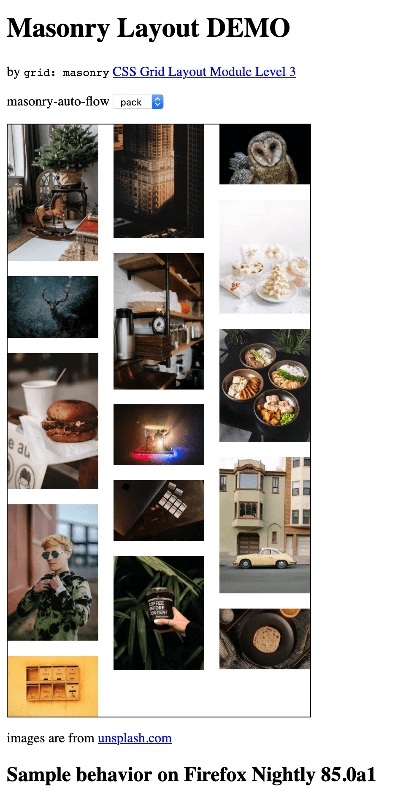

# [grid][layout][css] grid: masonry で Masonry Layout


## Intro

Pinterest でおなじみの Masonry Layout を CSS の標準にする作業と実装が進んでいる。


### Masonry Layout

以下のように画像を敷き詰めるタイルレイアウトのことを Masonry (石工やレンガ造りの意味らしい) Layout という。


上の例の場合は、 Height が不揃いの画像を並べる上で、左から敷き詰め、折り返したら既にある画像の高さに合わせて二列目が始まるというロジックになる。

これを実現するには、割と複雑な CSS を書く必要があり、様々なサイトで CSS ライブラリや、 Grid などを用いて再現する方法が紹介されている。

これをそのまま CSS の標準にする作業が行われており、既に一部が実装されている。


### grid: masonry;

仕様は以下だ。

- CSS Grid Layout Module Level 3
  - https://drafts.csswg.org/css-grid-3/

従来の CSS Grid は、縦横が揃った Grid を展開し、そこに対して要素を割り当てるのが基本だが、それでは縦が揃わない Masonry は実現できない。

そこで、 `grid-template-rows` / `grid-tempalet-columns` へ `masonry` を追加し、これを指定すると Masonry レイアウトが実現できるようになる。省略すると `grid: masonry / ${column}` になるため、 column に repeat などを指定すれば Pinterest のようなレイアウトが実現できる。

3 列の Masonly Layout は以下だ。


```html
<style>
.grid {
  display: inline-grid;
  grid: masonry / repeat(3, auto);
  border: 1px solid;
  gap: 1vw;
  masonry-auto-flow: pack;
  width: 32vw;
}
img {
  width: 10vw;
}
</style>
<div class=masonry>
  
  
  
  
</div>
```


### masonry-auto-flow

敷き詰めるためのアルゴリズムは仕様で決まっている。

- https://drafts.csswg.org/css-grid-3/#masonry-layout-algorithm

デフォルトでは、敷き詰める際に一番余白が空いているところに画像が挿入される。

これを制御するプロパティとして `masonry-auto-flow` が定義されており `next` にすると画像の HTML 上での出現順に積み上げるようにすることもできる。

このあたりのアルゴリズムは要件によって多様だと思われるため、仕様の策定とともに変わるだろうと思われる。


```css
masonry-auto-flow: pack;
masonry-auto-flow: next;
```

他の値もあるが実装はされてないようなので挙動はよくわからなかった。

- https://drafts.csswg.org/css-grid-3/#masonry-auto-flow


## DEMO

動作するデモを以下に用意した。

- <https://labs.jxck.io/>




## Resources

- Spec
- Explainer
- Requirements Doc
- Mozilla Standard Position
- Webkit Position
- TAG Design Review
- Intents
- Chrome Platform Status
- WPT(Web Platform Test)
- DEMO
- Blog
- Presentation
- Issues
- Other
